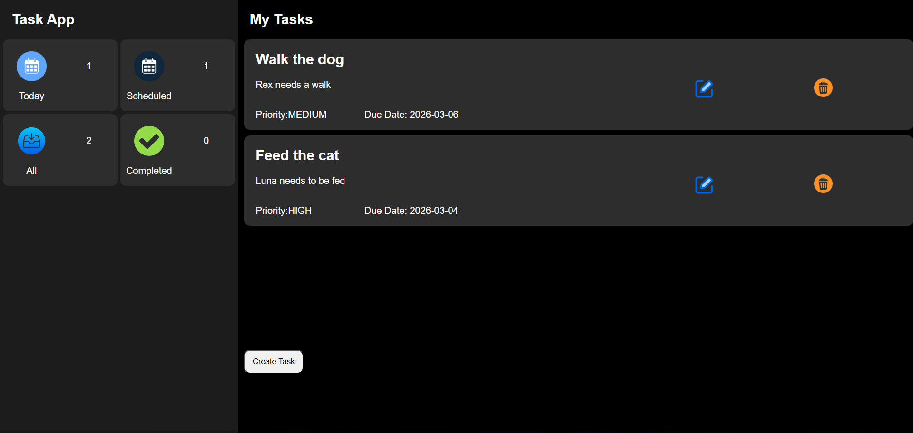
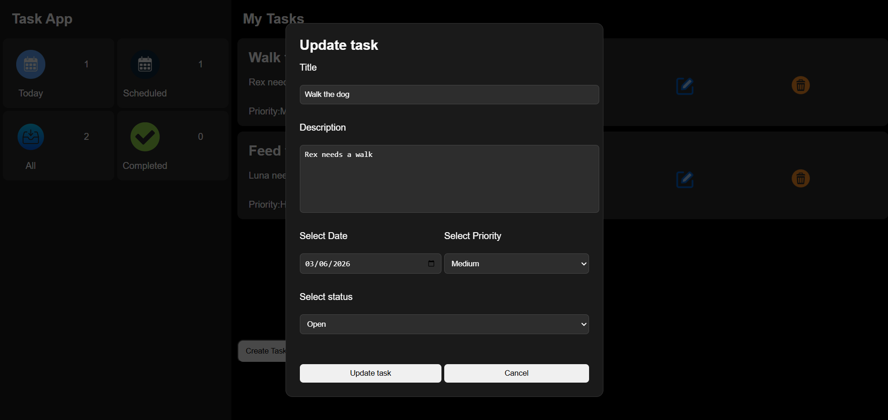
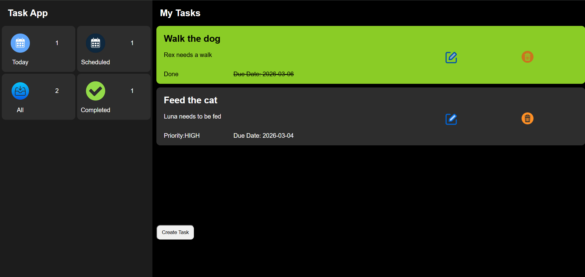
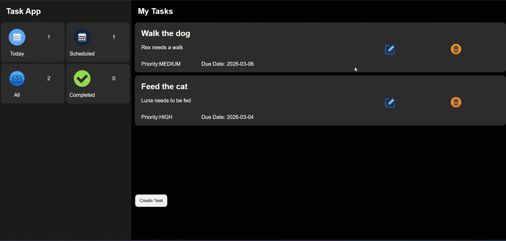

# Full-Stack Task Manager

A professional Task Management application built with a **Spring Boot** REST API and a **React** frontend. This project features a dynamic UI that reacts to task status changes with real-time styling updates.

## 🚀 Features
- **Full CRUD Operations**: Create, Read, Update, and Delete tasks.
- **Dynamic Task Status**: Toggle tasks between `OPEN` and `COMPLETE`.
- **Visual Feedback**: Completed tasks automatically feature strike-through text, lower opacity, and a green background.
- **Priority System**: Categorize tasks by `HIGH`, `MEDIUM`, or `LOW`.
- **Responsive Modals**: Uses native HTML5 `<dialog>` with React `useRef` for a smooth editing experience.
- **Real-time Notifications**: Integrated `react-toastify` for success and error alerts.

## Screenshots


| Dashboard (Open Tasks) | Task Update Modal |
| :--- | :--- |
|  |  |

| Completed Task View |
| :--- |
|  |



## 🛠️ Tech Stack
**Frontend:** 
- React.js (Hooks, Functional Components)
- Axios (HTTP Client)
- React-Toastify
- CSS (Transition animations & Conditional styling)

**Backend:**
- Java 
- Spring Boot
- Spring Data JPA
- MySQL Database
- Maven

---

##  Setup & Installation

### 1. Database Configuration
This project uses environment variables to keep credentials secure.
1. Create a MySQL database named `task_db` (or your preferred name).
2. Find the `.env.example` file in the task-backend directory.
3. Create a new file named `.env` and fill in your actual credentials:
   ```env
   DB_URL=jdbc:mysql://localhost:3306/task_db
   DB_USERNAME=your_username
   DB_PASSWORD=your_password

### 2. Backend Setup (Spring Boot)
1. Open your terminal and navigate to the backend folder: cd task-backend
2. Build the project and run the application using Maven: .\mvnw spring-boot:run
3. The server will start and be available at http://localhost:8080.

### 3. Frontend Setup (React)
1. Open a new terminal window and navigate to the frontend folder: cd task-frontend
2. Install all necessary dependencies: npm install
3. Start the React development server: npm run dev
4. View the app at http://localhost:5173/

###  API Reference
1. Method	Endpoint	          Description
2. GET	    /api/v1/tasks	      Retrieve all tasks
3. POST	  /api/v1/tasks	      Create a new task
4. PUT	    /api/v1/tasks/{id}	Update task details/status
5. DELETE	/api/v1/tasks/{id}	Remove a task permanently